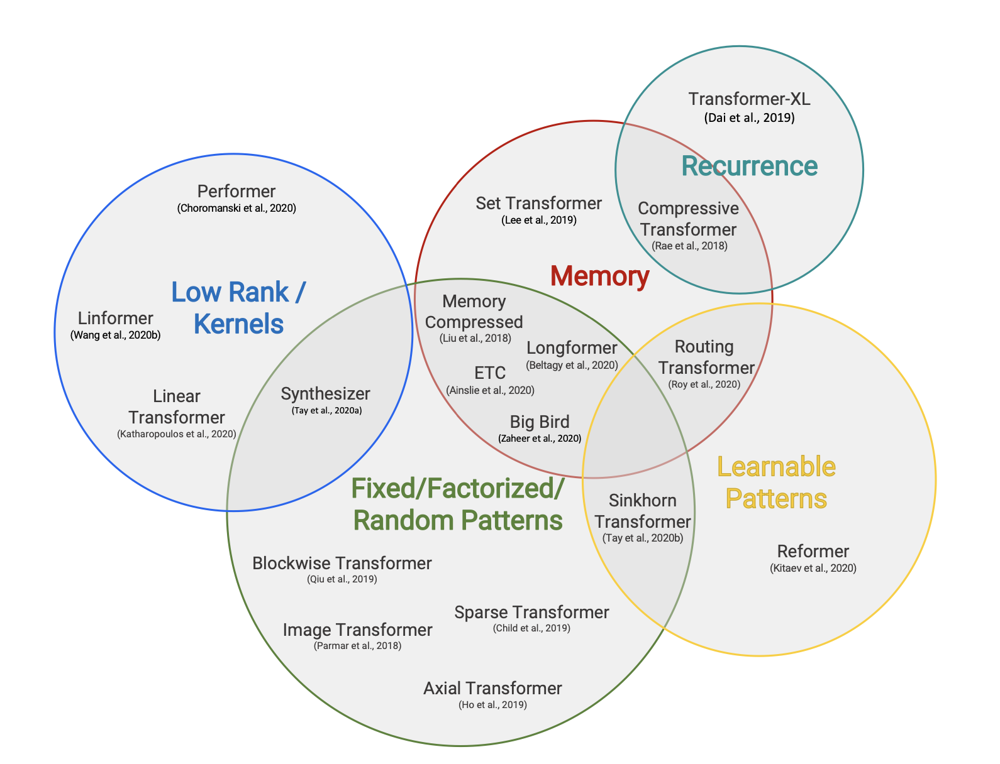
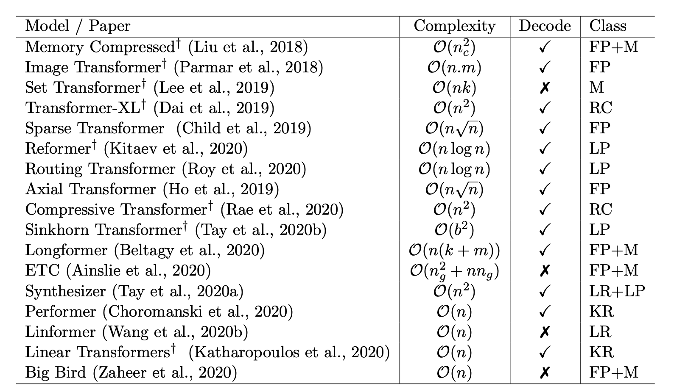
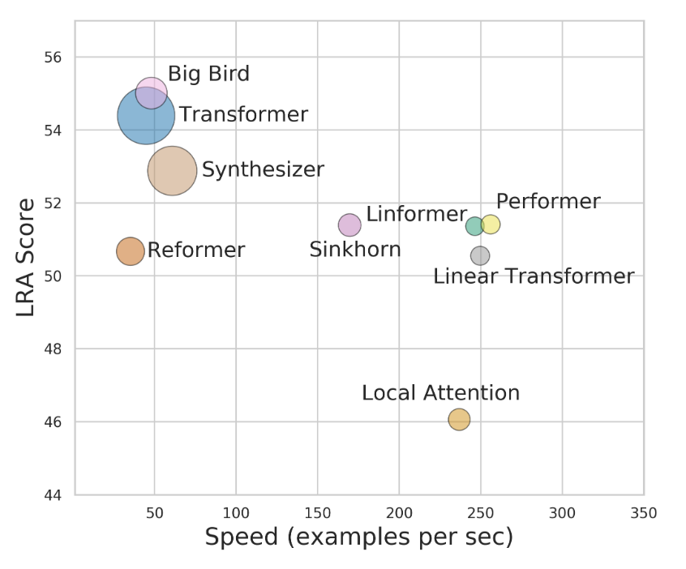
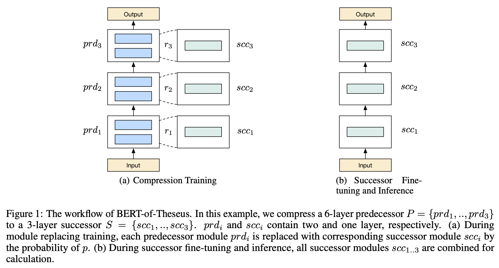
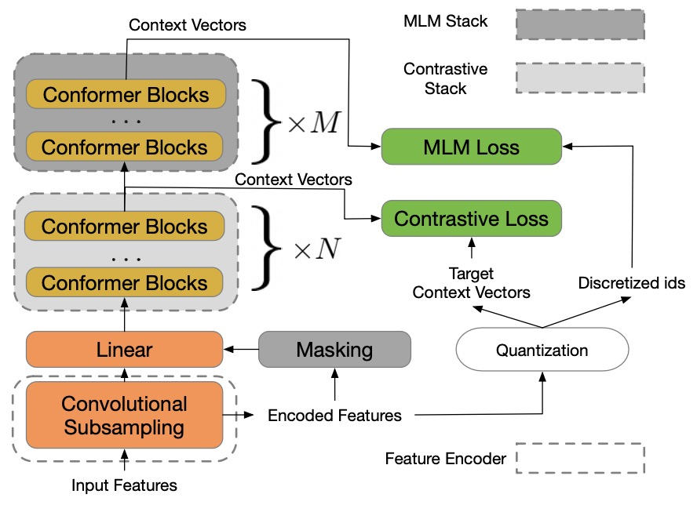

    
    <h1>
        Hulun Papers
    </h1>

个人近期论文阅读囫囵吞枣式极简笔记，用于备忘与快速查阅

## 1. Transformers

- Transformer不适合NER任务及其解决方案，[pdf](./papers/Transformer/TENER：Adapting_Transformer_Encoder_for_Named_Entity_Recognition.pdf)，[arXiv](https://arxiv.org/abs/1911.04474)，[知乎](https://zhuanlan.zhihu.com/p/137315695)

- FastFormer，一个Transformer加速方案(GPU&CPU)，[pdf](./papers/Transformer/FastFormers：Highly_Efficient_Transformer_Models_for_Natural_Language_Understanding.pdf)，[arXiv](https://arxiv.org/abs/2010.13382)，[知乎](https://zhuanlan.zhihu.com/p/275659092)

- Performer，Google提出的一种新的Transformer架构，提升推理与训练速度和内存利用率，[pdf](./papers/Transformer/Rethinking_Attention_with_Performers.pdf)，[arXiv](https://arxiv.org/pdf/2009.14794.pdf)，[知乎](https://zhuanlan.zhihu.com/p/269751265)，[github(tf)](https://github.com/google-research/google-research/tree/master/performer)，[github(torch)](https://github.com/lucidrains/performer-pytorch)

- Google 2020年的一篇Transformer综述，对比了当时各种Transformer变体，包括Performer、Linformer、Longformer等，[pdf](./papers/Transformer/Efficient_Transformers：A_Survey.pdf)，[arXiv](https://arxiv.org/abs/2009.06732)，[知乎](https://zhuanlan.zhihu.com/p/341476148)

  
  

- Google 2020年的另一篇Transformer综述，比较了Transformer各种变体的计算效率，下图的来源。[pdf](./papers/Transformer/long_range_arena：a_benchmark_for_efficient_transformers.pdf)，[arXiv](https://arxiv.org/abs/2011.04006)

	

- **FLASH**，最近新提出的一种Transformer变体，依然是Google出品，苏神先导复现结果较为乐观，值得尝试。[pdf](./papers/Transformer/Transformer_Quality_in_Linear_Time.pdf)，[arXiv](https://arxiv.org/pdf/2202.10447.pdf)，[苏剑林: 科学空间](https://spaces.ac.cn/archives/8934)

## 2. 模型压缩

### 2.1 模型剪枝

- LayerDrop，对每一层进行随机mask，提升模型每一层的鲁棒性，最终可以根据mask概率直接修剪模型，[pdf](./papers/Pruning/Reducing_Transformer_Depth_on_Demand_with_Structured_Dropout.pdf)，[arXiv](https://arxiv.org/pdf/1909.11556.pdf)，[知乎](https://zhuanlan.zhihu.com/p/93207254)

- BERT-of-Theseus，利用module-replacing思路对模型进行压缩，无需经过“先训大模型，再压缩成小模型”的耗时过程，[pdf](./papers/Pruning/BERT-of-Theseus：Compressing_BERT_by_Progressive_Module_Replacing.pdf)，[arXiv](https://arxiv.org/abs/2002.02925v1)，[苏神博客](https://kexue.fm/archives/7575)，[知乎:邱震宇](https://zhuanlan.zhihu.com/p/112787764)

	

### 2.2 模型蒸馏

- **The very beginning of the Model Distillation**，《Distilling the Knowledge in a Neural Network》，Geoffrey Hinton，[pdf](./papers/Distillation/Distilling_the_Knowledge_in_a_Neural_Network.pdf)，[arXiv](https://arxiv.org/abs/1503.02531)
- MobileBERT，一个移动端的NLP预训练模型，从目前网络上的资源来看，实验结果为在Pixel4上运行只需要40ms，GLUE得分为77.7，比BERT-base低0.6（[数据来源: 陈之炎的知乎回答](https://www.zhihu.com/question/333166072/answer/2349137395)）。现已加入google-research豪华午餐。[arXiv](https://arxiv.org/abs/2004.02984)，[知乎](https://zhuanlan.zhihu.com/p/365193320)，[github](https://github.com/google-research/google-research/tree/master/mobilebert)

## 3. Dialogue Management

- 对话管理综述(2021)，[pdf](./papers/Dialogue/DialogueManagement/A_Survey_on_Dialog_Management：Recent_Advances_and_Challenges.pdf)

## 4. 多模态

- data2vec，一个适用于视觉、语音、文本的自监督学习框架，[pdf](./papers/MultimodelFrame/data2vec：A_General_Framework_for_Self-supervised_Learning_in_Speech，Vision_and_Language.pdf)，[paper](https://scontent-nrt1-1.xx.fbcdn.net/v/t39.8562-6/271974914_483120576492438_4239522333319653600_n.pdf?_nc_cat=107&ccb=1-5&_nc_sid=ae5e01&_nc_ohc=4-cMR5tUq4QAX8dVp4v&_nc_ht=scontent-nrt1-1.xx&oh=00_AT8Zy56yb0ihUA9DMJnJpw4qb3xjC1Q4UbGwP3k1Lq_Baw&oe=61F3F7D1)，[夕小瑶](https://mp.weixin.qq.com/s/pJqKtqM8WQBm8FbgaxGmpQ)

## 5. 对比学习

- CPC，对比学习的基础模型，[pdf](./papers/ContrastiveLearning/Representation_Learning_with_Contrastive_Predictive_Coding.pdf)，[arXiv](https://arxiv.org/abs/1807.03748)，[github](https://github.com/davidtellez/contrastive-predictive-coding)

## 6. ASR

- wav2vec2.0，一个强大的语音预训练模型，使用了对比学习模式，[pdf](./papers/ASR/wav2vec2.0：A_Framework_for_Self-Supervised_Learning_of_Speech_Representations.pdf)，[wav2vec1.0 pdf](./papers/wav2vec：Unsupervised_Pre-training_for_Speech_Recognition.pdf)，[github](https://github.com/pytorch/fairseq/tree/main/examples/wav2vec)

- w2v-BERT，目前的SOTA(20220415)，结合了wav2vec2与HuBERT，利用MLM增强了wav2vec2的效果，[pdf](./papers/ASR/w2v-BERT：Combining_Contrastive_Learning_and_Masked_Language_Modeling_for_Self-Supervised_Speech_Pre-Training)，[arXiv](https://arxiv.org/abs/2108.06209v2)

  

- LREC2020上的一篇对NER在语音领域应用与研究现状的探讨，《Where are we in Named Entity Recognition from Speech》，[pdf](./papers/ASR/Where_are_we_in_Named_Entity_Recognition_from_Speech.pdf)，[pdf-online](https://aclanthology.org/2020.lrec-1.556.pdf)

## 7.NLP Pre-Train Model

- ELECTRA，一个我早就应该了解的预训练模型，效果与roberta持平，碾压BERT，具有更快的推理速度，[pdf](./papers/NLP-PTM/ELECTRA：Pre-Training_Text_Encoders_As_Discriminators_Rather_Than_Generators.pdf)，[arXiv](https://openreview.net/pdf?id=r1xMH1BtvB)，[github(google)](https://github.com/google-research/electra)，[github(Chinese-ELECTRA)](https://github.com/ymcui/Chinese-ELECTRA)，[知乎导读(李rumor)](https://zhuanlan.zhihu.com/p/89763176)
- PERT，SCIR在2022年3月份新出品的预训练模型，预训练任务为替换词序形成乱序文本后预测原token位置，[pdf](papers/NLP-PTM/PERT：Pre-Training_Bert_With_Permuted_Language_Model.pdf)，[arXiv](https://arxiv.org/pdf/2203.06906.pdf)，[github](https://github.com/ymcui/PERT)

## 8.TTS: Text-To-Speech

- FastSpeech2，[pdf](papers/TTS/FastSpeech2：Fast_and_High-Quality_End-to-End_Text_to_Speech.pdf)，[arXiv](https://arxiv.org/abs/2006.04558)

## *. 其他

- LSTM+CRF学习率不一致，[苏神博客：你的CRF层学习率可能不够大](https://spaces.ac.cn/archives/7196)

